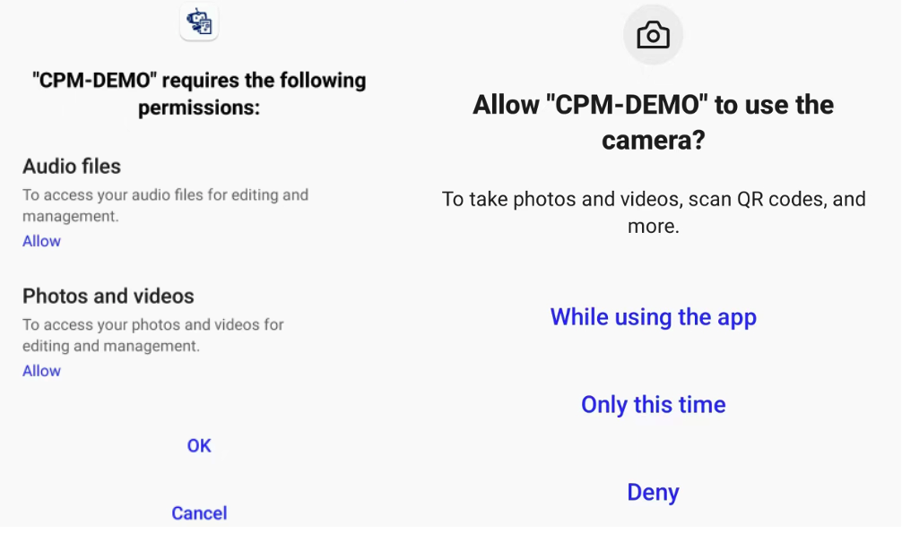
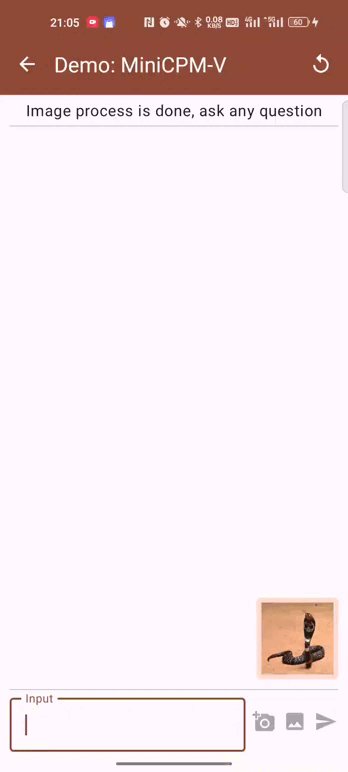

# MLC-MiniCPM

[中文版](https://github.com/OpenBMB/mlc-MiniCPM/blob/main/README-ZH.md)

Based on [MLC-LLM](https://github.com/mlc-ai/mlc-llm), we run MiniCPM and MiniCPM-V on android devices.

## Android APK

0. Install MiniCPM 1.2B and MiniCPM-V 2.0 [APK](https://openbmb.oss-cn-hongkong.aliyuncs.com/model_center/mobile/android/MiniCPM-2.0.apk) (old version can be found here: MiniCPM and MiniCPM-V [APK](https://openbmb.oss-cn-hongkong.aliyuncs.com/model_center/mobile/android/MiniCPM.apk))

1. Accept camera & photo permission: the permission are for MiniCPM-V which can process multimodel input (text + image)

    

2. Download model: (1) Press the download button (2) Wait for the progress bar to fill up (3) Start chat 

    **Caution：currently the two model can not be downloaded simultaneously due to the bug in downloading.**

    

3. Chat with MiniCPM: (1) Wait for model initialization until "Ready to chat" pop up. (2) Type and send question

4. Chat with MiniCPM-V: (1) Wait for model initialization until "Ready to chat" pop up. (2) Upload image (3) Wait until "process image done" show up (4) Type and send question

    **Note：image process may take some time.**

    

5. Demo:

    

Note that the models run on android are quantized to 4-bit and may lose some performance.
The non-quantized models can be found [here](https://github.com/OpenBMB/miniCPM).

## Prepare Enviroment

Follow https://llm.mlc.ai/docs/deploy/android.html to prepare requirements.

For the **Compile PyTorch Models from HuggingFace** session, use our github repo and conduct the following instructions to install our modified version of mlc_chat.

```
mkdir -p build && cd build
# generate build configuration
python3 ../cmake/gen_cmake_config.py && cd ..
# build `mlc_chat_cli`
cd build && cmake .. && cmake --build . --parallel $(nproc) && cd ..
# install
cd python && pip install -e . && cd ..
```

## Compile Model

put huggingface downloaded model checkpoint into `dist/models`.

For MiniCPM
```
MODEL_NAME=MiniCPM
QUANTIZATION=q4f16_1
MODEL_TYPE=minicpm
mlc_chat convert_weight --model-type ${MODEL_TYPE} ./dist/models/${MODEL_NAME}-hf/ --quantization $QUANTIZATION -o dist/$MODEL_NAME/
mlc_chat gen_config --model-type ${MODEL_TYPE} ./dist/models/${MODEL_NAME}-hf/ --quantization $QUANTIZATION --conv-template LM --sliding-window-size 768 -o dist/${MODEL_NAME}/
mlc_chat compile --model-type ${MODEL_TYPE} dist/${MODEL_NAME}/mlc-chat-config.json --device android -o ./dist/libs/${MODEL_NAME}-android.tar
cd ./android/library
./prepare_libs.sh
cd -
```

For MiniCPM-V (vision version)
```
MODEL_NAME=MiniCPM-V
QUANTIZATION=q4f16_1
MODEL_TYPE=minicpm_v
mlc_chat convert_weight --model-type ${MODEL_TYPE} ./dist/models/${MODEL_NAME}-hf/ --quantization $QUANTIZATION -o dist/$MODEL_NAME/
mlc_chat gen_config --model-type ${MODEL_TYPE} ./dist/models/${MODEL_NAME}-hf/ --quantization $QUANTIZATION --conv-template LM --sliding-window-size 1024 -o dist/${MODEL_NAME}/
mlc_chat compile --model-type ${MODEL_TYPE} dist/${MODEL_NAME}/mlc-chat-config.json --device android -o ./dist/libs/${MODEL_NAME}-android.tar
cd ./android/library
./prepare_libs.sh
cd -
```

`--sliding-window-size` are set only for mobile phones to limit memory usage, and can be set smaller or larger base on your phone.

## Build Android App

Go to `android/` and use Android Studio to build the app. (Follow https://llm.mlc.ai/docs/deploy/android.html)
